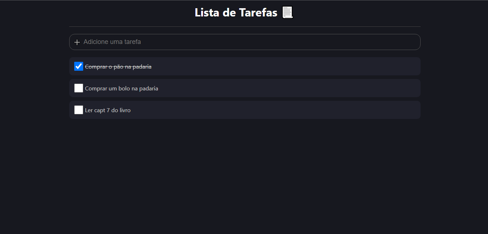

<h1 align="center">
    To-do list
</h1>

## 📃 Sobre

https://confident-turing-527ddc.netlify.app/

App de lista de tarefas utilizando a biblioteca ReactJS com styled components e typescript. Basicamente a aplicação consiste no usuário adicionar tarefas para realizar ao longo do dia e assim que concluí-las clicar no checkbox para marcar como concluída.

---

## 📚 Principais aprendizados

- Conceito de estado
- Componentização
- Produtividade com a lib styled components
- A importância da utilização de TypeScript para tipagem de props

---

## 🚀 Tecnologias utilizadas

O projeto foi desenvolvido com as seguintes tecnologias:

- ReactJS
- Styled Components
- TypeScript

---

## 📷 Imagens

<h1 align="center">
    
</h1>

## 📁 Como baixar o projeto

```bash

    # Clonar o repositório
    $ git clone https://github.com/EnzoXavier1001/to-do-list

    # Entrar no diretório
    $ cd to-do-list

    # Executar o comando
    $ npm start

```
